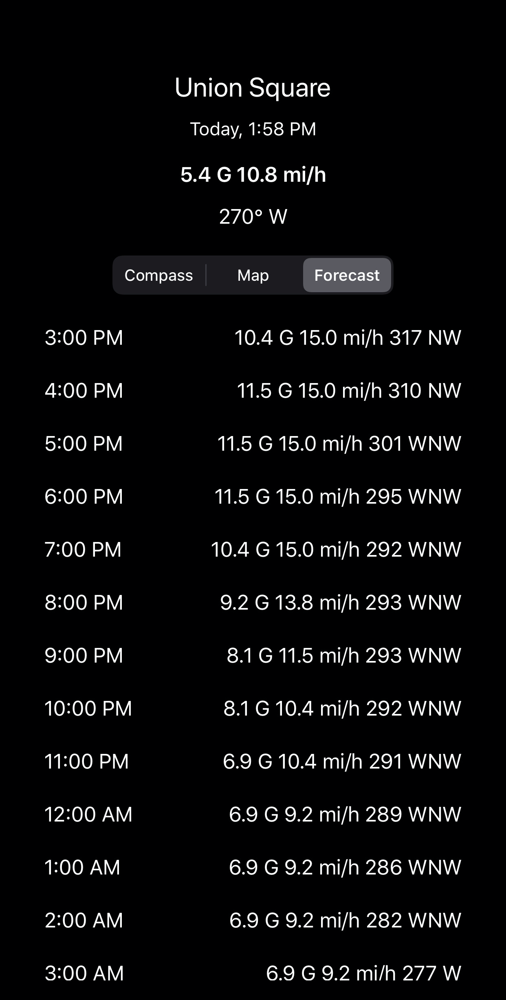
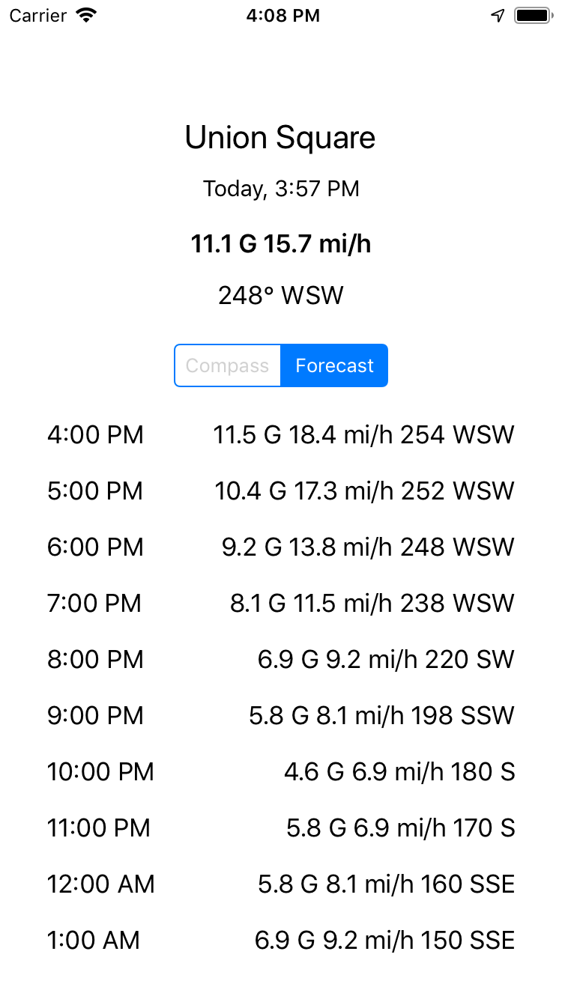
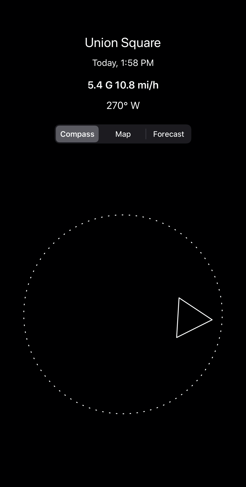
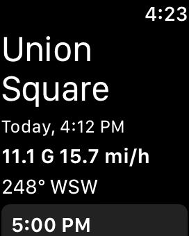
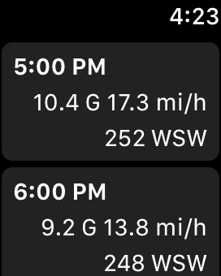
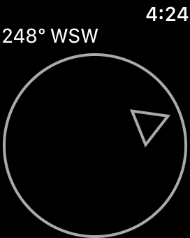
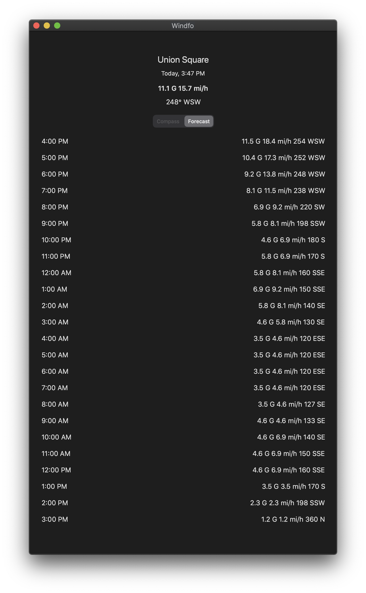

## Windfo

Wind forecast iOS app. Weather sourced from AccuWeather.

### AccuWeather API Key

Create `Windfo/Services/WFSecretKeys.h` and define `kAccuWeatherKey` to your API key:

```objc
#ifndef kAccuWeatherKey
#   define kAccuWeatherKey @"9WjCWS2GpWTmy1bgsYet66RDWD5Fpf6E"
#endif
```

### TODOs

- Localization

### Screenshots





<br>





